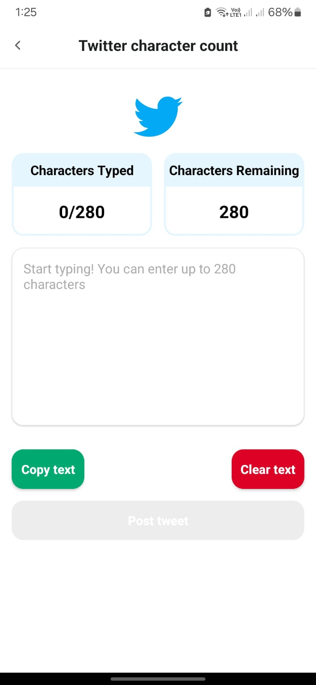
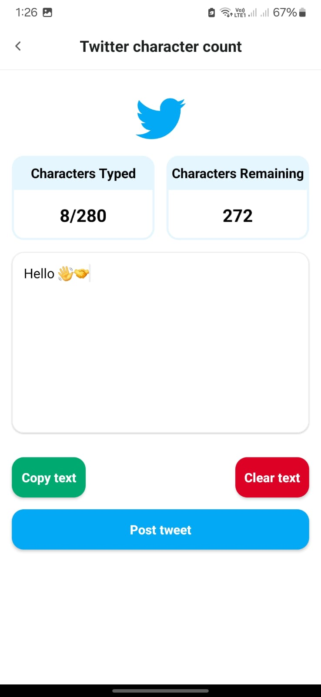
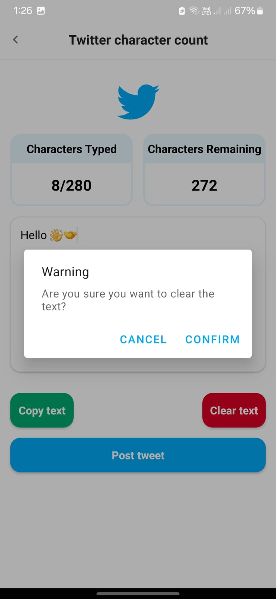
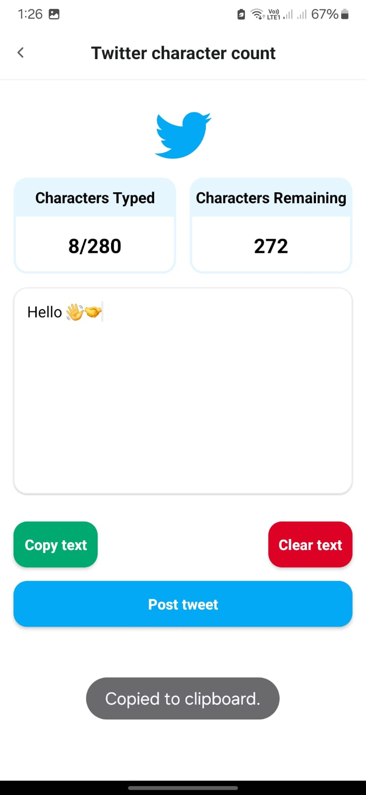
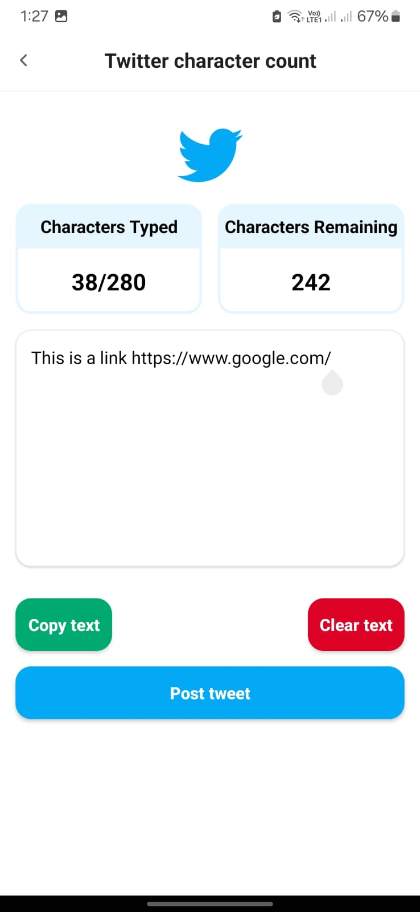
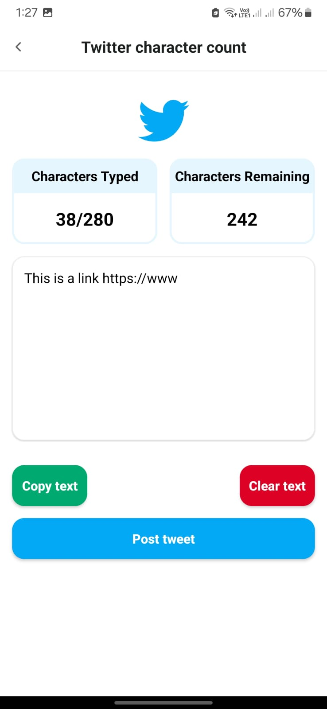
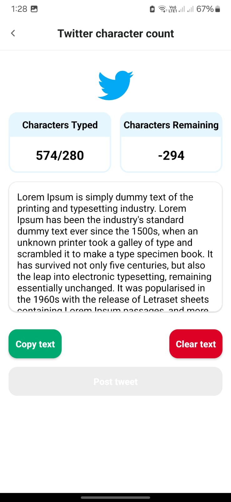

# Twitter Counter

## Overview

Twitter Counter is a simple application that allows users to input text and see how many characters are counted towards Twitter's character limit. The app takes into account special cases such as URLs, emojis, and characters from different languages. Additionally, users can post their tweets directly from the app. The app is built using modern Android development practices including MVVM architecture, Jetpack components, and Dependency Injection with Hilt.

## Features

- Count characters in a tweet considering Twitter's character count rules.
- Handles special cases like URLs, emojis, and complex language characters.
- Post tweets directly from the app.

## Architecture

The app follows the MVVM (Model-View-ViewModel) architecture pattern and is divided into several modules:

1. **Domain Module**: Contains the business logic and use cases. This module is a plain Kotlin library and does not depend on Android framework classes.
2. **Data Module**: Manages data sources (e.g., remote APIs, local database) and repositories.
3. **Presentation Module**: Contains the UI components, ViewModels, and their interactions.

## Project Structure

- `domain`: Contains use cases, entities, and repository interfaces.
- `data`: Implements the repositories and data sources (e.g., network and local).
- `presentation`: Contains the UI components and ViewModels.

## Dependencies

### Version Catalog

Using a version catalog helps to manage dependencies in a centralized manner, making it easier to update and maintain consistent versions across the project.

### Key Dependencies

- Kotlin Coroutines for asynchronous programming
- Hilt for dependency injection
- Jetpack components like LiveData, ViewModel
- Retrofit for network calls

## Installation

1. **Clone the repository**:
    ```sh
    git clone https://github.com/eslamemad99/twitter-counter.git
    cd Twitter Counter
    ```

2. **Open the project in Android Studio**.

3. **Build the project**:
    Ensure you have the latest version of Android Studio and the necessary SDKs installed. Sync the project with Gradle files to download all dependencies.

4. **Run the app**:
    Connect an Android device or start an emulator and run the app from Android Studio.

## Usage

### Running Tests

To run the unit tests, execute the following command:

```sh
./gradlew test
```

## Screenshots

| Screenshot 1 | Screenshot 2 |
|--------------|--------------|
|  |  |
|  |  |
|  |  |
|  |                                     |

## License
This project is licensed under the MIT License. See the [LICENSE](LICENSE) file for more details.

## Contact
For any questions or feedback, feel free to reach out to the project maintainer:

- **Name:** Eslam Emad
- **Email:** [eslamemad903@gmail.com](mailto:eslamemad903@gmail.com)
